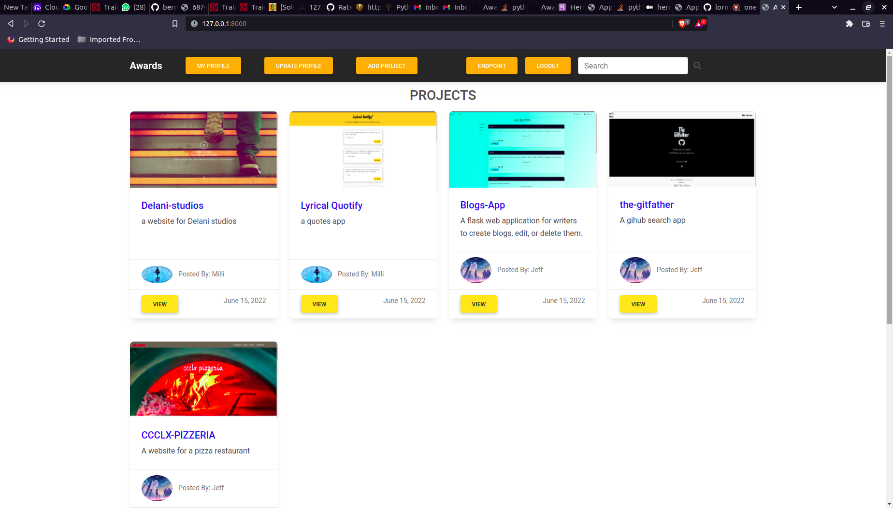

#### Awards - an application rating platform for software developers , 14/07/2020.
#### By Jeff Huria

## Description
Awards is a platform that allows developers to submit their projects/applications to be rated based on design, usability and content. Developers are also able to see other developers' profile and projects. Each day, the project with the highest average score is featured on the landing page.

## Live link
Visit the application on https://jeffawards.herokuapp.com/ .

## Development
To make advancements/modifications, follow these steps:

- Fork the repository
- Create a new branch (`git checkout -b improve-feature`)
- Make the appropriate changes in the files
- Add changes made
- Commit your changes (`git commit -am 'Improve feature'`)
- Push to the branch (`git push origin improve-feature`)
- Create a Pull Request 

## Setup & Run instructions
- Create and activate a virtual environment
- Install the dependencies listed in the `requirements.txt`
- Create a `.env` file. This will contain environment variables.
- Finally, run your app on `MODE='dev'` config for debugging purposes

## Technologies Used
Technologies used to develop this application:

1. Python v3.6
2. Django 3.0.7
3. Javascript
4. Cloudinary
5. Bootstrap
6. HTML 
7. CSS

## Support and contact details

Should you be unable to access the website, have any recommendations and/or questions, feel free to email me:[jeffhuria@gmail.com](mailto:jeffhuria@gmail.com)

## [License]MIT

Copyright (c) 2022 [Jeff Huria](https://github.com/JKLLR)  